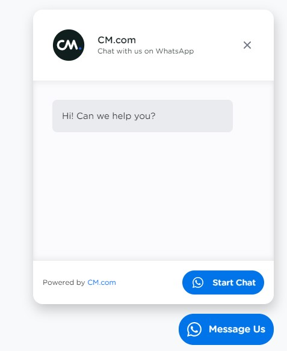

# CM WhatsApp Chat Widget

> **Important Notice**: This package is hosted on GitHub **temporarily** and will be deleted **before April 1st 2022**. Make sure to download the repository and host the scripts and assets yourself.


Create and customize your own WhatsApp "Click to Chat" widget for use on your website. Customers can click on the button and start a conversation on WhatsApp with your preconfigured number.



# Installation Option 1
To get started, add the following script between your `<body>` tags, preferably on the bottom of your page. Make sure to replace `!!REPLACE_ME!!` with the actual URL of your `cm_wa_chat_widget.js`.

```html
<script>
        var url = '!!REPLACE_ME!!';
        var s = document.createElement('script');
        s.type = 'text/javascript';
        s.async = true;
        s.src = url;

        var options = {}

        s.onload = function () {
            cm_whatsapp_chat.createWidget(options);
        };
        var x = document.getElementsByTagName('script')[0];
        x.parentNode.insertBefore(s, x);
    </script>
```

# Installation Option 2
Add the contents of ZIP (excluding README, LICENSE etc) to your existing assets folder of your app, and initialize the widget with `cm_whatsapp_chat.createWidget(options);`. See Configuration for the Options interface.

# Configuration
Without any configuration, the widget doesn't know which phone number you want to send a message to. Let's configure the widget. Make sure to add your options as a valid JSON object to the `var options` part of the initialization script (the one above this paragraph).

> Parameters with an optional chaining operator (?) are not required.
```ts
interface Options {
    generalSettings: {
        widgetEnabled: boolean;
        phoneNumber: string;
        prefilledMessage: string;
    }
    button?: {
        backgroundColor: string;
        borderRadiusPx: number;
        text: string;
        textColor: string;
    }
    chatWindow?: {
        styling?: {
            borderRadiusPx?: number;
        }
        header?: {
            logoUrl?: string; // Preferably 54px x 54px.
            title?: string;
            subTitle?: string;
        }
        content?: {
            borderRadiusPx?: number;
            chatMessage: string;
        }
        footer?: {
            buttonBorderRadiusPx?: number;
            buttonBackgroundColor?: string;
            buttonText: string;
        }
    }
}
```

# Disclaimer
WhatsApp and the WhatsApp logo are registered trademarks of Facebook Inc. @cmdotcom/text-whatsapp-widget-javascript is under MIT license. See LICENSE file.